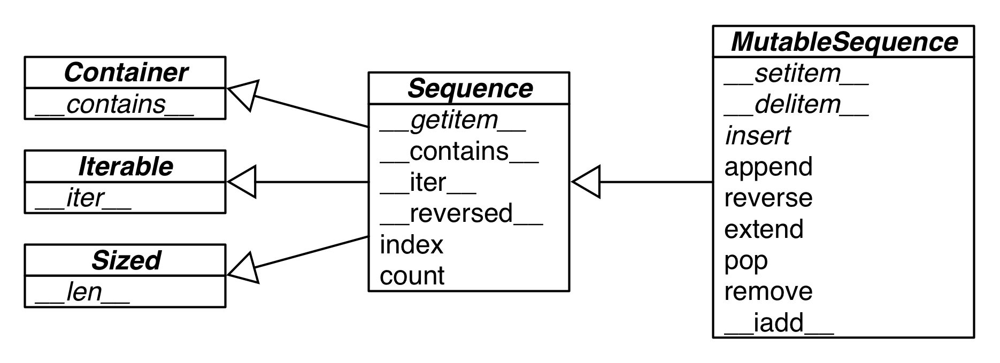

# Part I. Prologue

## The Python Data Model

本章主要介绍了`__getitem__` 与 `__len__`.

当用户使用`for s in S`这样的语句时，python解释器会首先寻找S有没有实现`__iter__`,如果没有，则会寻找`__getitem__`.

# Part II.  Data Structures

## chapter 2 An array of sequences

### Overview of built-in sequences

*Container sequences*
​	list, tuple and collections.deque can hold items of different types.
*Flat sequences*
​	str, bytes, bytearray, memoryview and array.array hold items of one type.

*Mutatble*

​	list, bytearray, array.array, collections.deque and memoryview

*Immutable seqences*

​	tuple, str, and bytes

